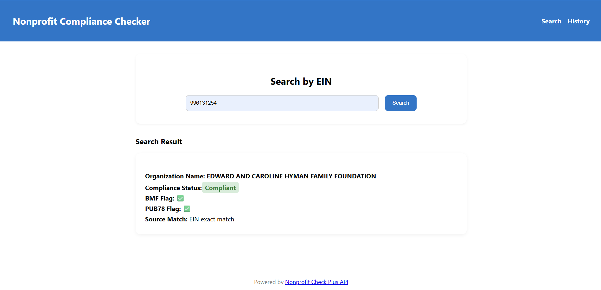
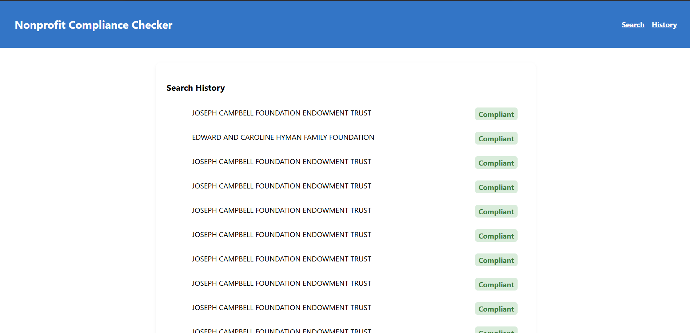
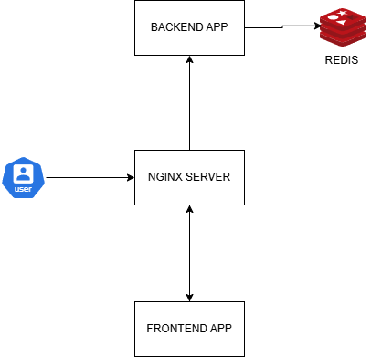

# Nonprofit Compliance Checker Microapp

## Overview

This project is a full-stack web application designed to help users check the compliance status of nonprofit organizations. It uses as a microfrontend and microservice architecture, allowing users to input an EIN (Employer Identification Number), retrieve compliance data from the Nonprofit Check Plus API, and display the results in a user-friendly interface. Additionally, it logs search history to the backend. You can access the live app on this link: https://frontend.compliance-checker.gooinfo.xyz/

## Features

*   **Nonprofit Compliance Lookup**: Easily search for nonprofit organizations by EIN to retrieve their compliance status.
*   **Detailed Results Display**: View comprehensive compliance information, including name, status, and source matches, presented in a clean and intuitive UI.
*   **Search History Logging**: All search queries are logged to the backend service, providing a history of past checks.
*   **Microservice Architecture**: The application is built with a clear separation between the frontend (Angular) and backend (NestJS), promoting scalability and maintainability.
*   **Dockerized Environment**: The entire application, including the frontend, backend, and a Redis instance for caching and data storage, is containerized using Docker for consistent development and deployment.
*   **API Proxy Layer**: The backend acts as a proxy to the external Nonprofit Check Plus API, handling requests and data retrieval securely.
*   **Basic User Authentication (Simulated)**: Includes a basic authentication mechanism (hardcoded token) to simulate real-world usage scenarios.


## Demo

Currently the application is deployed on AWS in an EC2 instance using [Caprover](https://caprover.com/docs/get-started.html) and can be accessed on this link: https://frontend.compliance-checker.gooinfo.xyz/


The backend url can be accessed here: https://backend.compliance-checker.gooinfo.xyz/


Below is a screenshot of the Search Non-Profit Page:



Below is a screenshot of the Search History Page:



## Architecture Overview

The application is built with a microfrontend and microservice architecture, promoting modularity, scalability, and independent deployment of components.



### Frontend Architecture (Angular)

The frontend is developed as a Single Page Application (SPA) using Angular. It follows a component-based architecture, where UI elements are encapsulated into reusable components. Key architectural aspects include:

*   **Component-Based UI**: The user interface is composed of distinct Angular components (e.g., `search-non-profit`, `history`, `navbar`, `footer`, `compliance-result`, `history-entry`) that manage their own state and rendering.
*   **Service Layer**: Dedicated `ComplianceCheckerService` Angular service that handles business logic, data fetching, and interaction with the backend API, ensuring a clean separation of concerns from the UI components.
*   **Routing**: Angular's routing module manages navigation between different views (e.g., search page, history page) within the single-page application.

### Backend Architecture (NestJS)

The backend is a NestJS microservice designed to act as an API proxy layer and data persistence layer. It leverages NestJS's modular structure and dependency injection for a robust and maintainable codebase. Key architectural aspects include:

*   **Modular Design**: The backend is organized into distinct modules (e.g., `AppModule`, `ComplianceModule`, `HttpModule`, `RedisModule`) each responsible for a specific feature or domain, enhancing maintainability and scalability.
*   **API Proxy**: It serves as an intermediary (proxy) between the frontend and the external Nonprofit Check Plus API, handling requests, potentially transforming data, and securing API keys.
*   **History Logging**: Search queries are logged to the backend and stored in Redis, providing a history of past checks.
*   **Redis Integration**: Utilizes Redis for in-memory data storage, which is used for caching API responses and seach history.
*   **Authentication Middleware**: Includes a basic authentication mechanism (simulated with a hardcoded token) implemented as middleware, demonstrating how security concerns can be integrated into the request pipeline.
*   **Dependency Injection**: NestJS's powerful dependency injection system is used throughout, making components easily testable and managing their dependencies effectively.

## Technologies Used

### Frontend
*   **Angular**: A powerful framework for building dynamic single-page applications.
*   **TypeScript**: A superset of JavaScript that adds static typing.
*   **HTML/CSS**: For structuring and styling the user interface.

### Backend
*   **NestJS**: A progressive Node.js framework for building efficient, reliable, and scalable server-side applications.
*   **TypeScript**: For robust and maintainable backend code.
*   **Redis**: Used for in-memory data storage, likely for caching or session management.

### Deployment & Containerization
*   **Nginx**: A web server that is used as a static web server and reverse proxy that serves the built Angular app and handles client-side routing and also proxies API requests from frontend to backend.
*   **Docker**: For containerizing the frontend, backend, and Redis services.
*   **Docker Compose**: For defining and running multi-container Docker applications locally.
*   **CapRover**: A PaaS (Platform as a Service) for deploying the web application to AWS.
*   **AWS**: Cloud Provider used for deploying our application on an EC2 instance and managed with Caprover.


## Setup Instructions

To get the Nonprofit Compliance Checker Microapp up and running on your local machine, follow these steps:

### Prerequisites

Ensure you have the following installed:
*   [Docker Desktop](https://www.docker.com/products/docker-desktop) (includes Docker Engine and Docker Compose)

### Local Setup with Docker Compose

1.  **Clone the repository**:
    ```bash
    git clone https://github.com/godwintrav/Nonprofit-Compliance-Checker-Microapp
    cd nonprofit-compliance-checker-microapp
    ```

2.  **Create Backend Environment File**:
    Navigate to the `backend` directory and create a `.env` file. You can copy the example:
    ```bash
    cp backend/.env.example backend/.env
    ```
    Open `backend/.env` and configure all necessary environment variables.

3.  **Build and Run with Docker Compose**:
    From the project root directory, run the following command to build the Docker images and start the services:
    ```bash
    docker-compose up --build
    ```
    This command will:
    *   Build the Docker images for both the `frontend` and `backend` services.
    *   Start the `redis` service.
    *   Start the `backend` service, which depends on `redis`.
    *   Start the `frontend` service, which depends on `backend`.

4.  **Access the Application**:
    Once all services are up and running, you can access the frontend application in your web browser at:
    ```
    http://localhost
    ```
    The backend API will be accessible at `http://localhost:3000`.

## Deployment with CapRover

This application is configured for easy deployment using CapRover. Each service (frontend and backend) has its own `captain-definition` file.

### Prerequisites for CapRover Deployment

*   A running [CapRover](https://caprover.com/docs/get-started.html) instance either on EC2 or any server that has been setup to run Caprover with docker.
*   `caprover-cli` installed and configured on your local machine.
* Created frontend application and backend application on the Caprover instance.
* Created Redis instance on the Caprover instance using One Click Apps section.
* Update the `captain-definition` file path in the backend application you created on Caprover to point to the `captain-definition` file in the `backend` directory
* Update the `captain-definition` file path in the frontend application you created on Caprover to point to the `captain-definition` file in the `frontend` directory

### Deployment Steps

1.  **Deploy the Backend**:
    Deploy the backend service using CapRover CLI:
    ```bash
    caprover deploy
    ```
    Follow the prompts to select your CapRover instance and app name you created for backend from the prerequisites (e.g., `nonprofit-checker-backend`).

2.  **Deploy the Frontend**:
    Deploy the frontend service using CapRover CLI:
    ```bash
    caprover deploy
    ```
    Follow the prompts to select your CapRover instance and app name you created for frontend from the prerequisites (e.g., `nonprofit-checker-frontend`).

3.  **Configure CapRover Routes**:
    Ensure your CapRover apps(including redis) are configured to communicate correctly. You will need to set up environment variables in CapRover for the backend. Update the nginx configuration in `frontend/nginx.conf` to point to the internal DNS name for the backend application url and port.

## Project Structure

```
.
├── README.md
├── docker-compose.yml
├── frontend/                 # Angular Frontend Application
│   ├── Dockerfile
│   ├── captain-definition
│   ├── package.json
│   ├── src/
│   │   ├── app/
│   │   │   ├── components/
│   │   │   ├── history/
│   │   │   ├── model/
│   │   │   ├── services/
│   │   │   └── search-non-profit/
│   │   └── main.ts
│   └── ...
├── backend/                  # NestJS Backend Application
    ├── Dockerfile
    ├── captain-definition
    ├── package.json
    ├── src/
    │   ├── main.ts
    │   ├── middlewares/
    │   ├── modules/
    │   │   ├── app.controller.ts
    │   │   ├── app.module.ts
    │   │   ├── compliance/
    │   │   ├── http/
    │   │   └── redis/
    │   └── ...
    └── ...

```

## Assumptions

- I assumed that the search history should be every EIN searched by every user and thus allowing duplicates to ensure the history is up to date.
- I hardcoded the authentication token to simulate a real world auth token.
- I used the test Bearer Token for the Pactman API for authorization when communicating with the endpoint.
- I used only EIN because the Pactman API only accepts EIN and not Organization name.
- I used Redis for storage to mock a Database.


## License

This project is open-source and available under the [MIT License](LICENSE).
